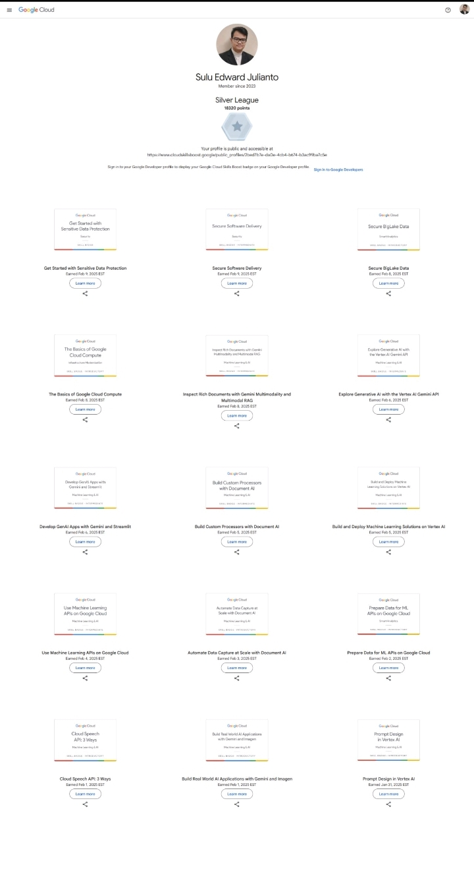
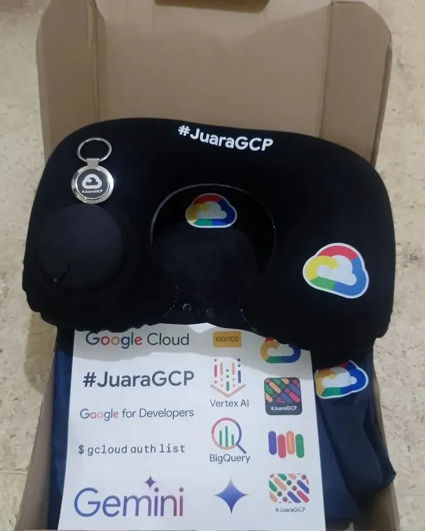
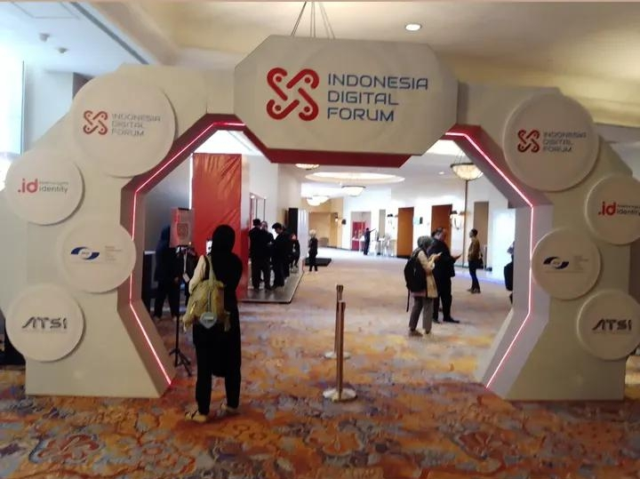
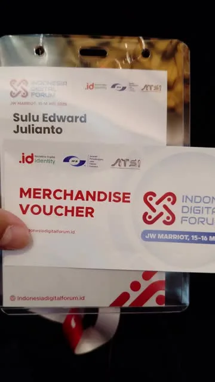
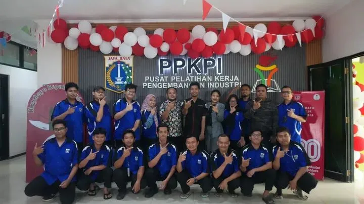
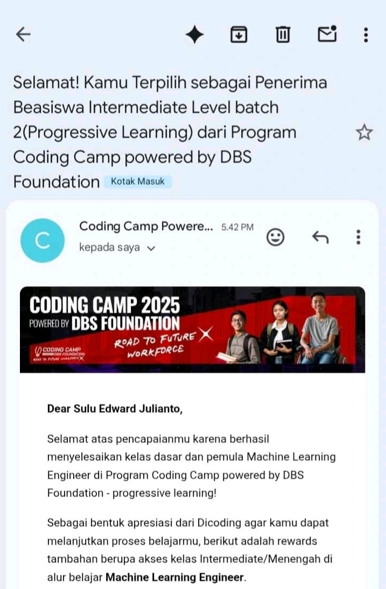
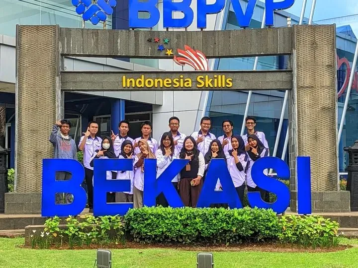
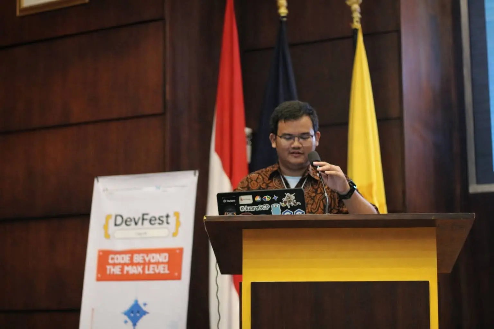
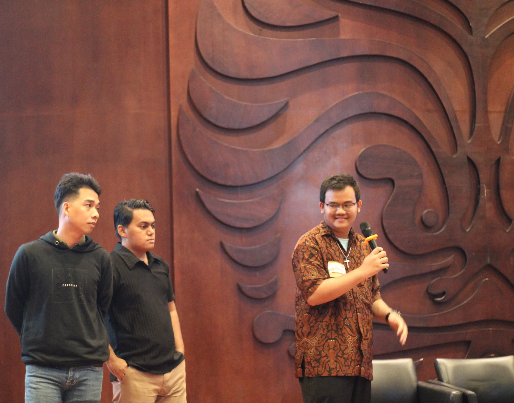

Kalau saya harus merangkum 2025 dalam satu kalimat: **tahun ini saya berhenti “ingin”, lalu mulai membuktikan**.  
2025 saya jadikan sebagai tahun untuk lebih serius membangun arah di bidang IT. Bukan sekadar “ikut ini-itu”, tapi menyusun perjalanan belajar yang rapi, menyelesaikan program sampai tuntas, dan menjaga dokumentasi agar progresnya nyata.

Saya tidak menulis ini untuk terlihat sempurna. Saya menulis ini untuk mendokumentasikan pertumbuhan: apa yang saya ikuti, apa yang saya kerjakan, dan pelajaran apa yang saya dapatkan. Karena pada akhirnya, proses yang rapi itu bukan hanya enak dibaca, tapi juga membantu saya tetap waras saat menghadapi hal baru.

Postingan ini saya tulis sebagai rangkuman perjalanan tersebut, lengkap dengan dokumentasi dan tautan pendukung di setiap bagian.

---

## Problem

Tantangan utama saya di 2025 adalah bagaimana membuat proses belajar menjadi sesuatu yang terukur dan bisa dibuktikan:

- Belajar secara konsisten dengan jalur yang jelas.
- Mengubah materi menjadi hasil nyata (tugas, proyek, dokumentasi).
- Menjaga kualitas proses: rapi, terstruktur, dan profesional.

---

## Solution

Saya memilih pendekatan yang sederhana tapi efektif:

- Mengikuti program yang relevan dengan target saya (cloud/AI, web dev, Machine Learning, dan penguatan stack).
- Menyelesaikan setiap fase sampai tuntas, lalu mendokumentasikan hasilnya.
- Menjaga ritme belajar tetap stabil, tanpa perlu dramatisasi “kendala”, karena fokus saya adalah progres dan kualitas.

---

## 1) JuaraGCP Season 11 (Google Cloud AI Study Jam)

Saya membuka tahun ini dengan **JuaraGCP Season 11**, sebuah program yang banyak bertumpu pada **hands-on labs** (Google Cloud Skills Boost). Pola belajarnya sangat cocok untuk saya, karena langsung praktik dan jelas targetnya.

Di fase ini saya banyak mengeksplorasi topik cloud yang terkait AI/data, termasuk layanan seperti Vertex AI, Gemini, BigQuery, Document AI, dan Cloud Speech API. Saya juga bersentuhan dengan materi yang menyinggung praktik keamanan dan delivery dalam konteks ekosistem cloud.

Kalau ada satu hal yang paling terasa dari JuaraGCP, itu adalah kebiasaan belajar yang lebih rapi: memahami alur, mencoba langkah demi langkah, lalu menyelesaikan sampai tuntas.

**Highlight yang saya catat dari fase ini:**
- Terbiasa belajar lewat praktik langsung (labs), bukan hanya teori.
- Lebih memahami “workflow” cloud dan pemakaian layanan untuk kebutuhan AI/data.
- Ritme belajar jadi lebih stabil karena targetnya jelas.

### Dokumentasi



### Referensi
- [Post/rekap JuaraGCP](https://www.linkedin.com/posts/sulujulianto_juaragcp11-juaragcp-juaragcp-activity-7294508491090599937-fSfC?utm_source=share&utm_medium=member_desktop&rcm=ACoAAC3QJPoBpHixAx4NgbbCIh10mMBCc3btDlM)
- [Dokumentasi tambahan (profile/labs)](https://www.skills.google/public_profiles/2bed7b7e-da0e-4cb4-b674-b3ac99ba7c5e)
- [Hasil mengikuti JuaraGCP Season 11](https://www.linkedin.com/posts/sulujulianto_juaragcp-googlecloud-cloudengineer-activity-7336356902026563585-xo-N?utm_source=share&utm_medium=member_desktop&rcm=ACoAAC3QJPoBpHixAx4NgbbCIh10mMBCc3btDlM)

---

## 2) Indonesia Digital Forum 2025 (Networking & Insight)

Saya menghadiri **Indonesia Digital Forum 2025** selama **dua hari (15–16 Mei 2025)** di **JW Marriott Jakarta**, dengan tema *“Kolaborasi dan Sinergi Membangun Ekosistem Digital Indonesia”*.  
Forum ini digagas melalui kolaborasi pemangku kepentingan ekosistem digital (termasuk PANDI, APJII, dan ATSI).

Untuk saya pribadi, IDF bukan tempat “belajar teknis” seperti bootcamp. Nilai utamanya ada pada **wawasan dan relasi**: mendengar diskusi lintas sektor dan melihat bagaimana isu digital dibahas dari sisi kebijakan hingga implementasi. Di pemberitaan, IDF 2025 menyoroti beragam aspek ekosistem digital seperti infrastruktur, platform, perangkat lunak/aplikasi, data & keamanan digital, ekonomi digital, serta regulasi/kebijakan.

**Hal yang saya dapatkan dari fase ini:**
- Mendapat gambaran yang lebih luas tentang arah dan tantangan ekosistem digital.
- Menambah perspektif bahwa kerja di IT juga terkait konteks, regulasi, dan kolaborasi.
- Membangun relasi dan memperluas jejaring dalam ekosistem digital.

### Dokumentasi



### Referensi
- [Website/Info resmi IDF](https://indonesiadigitalforum.id/)

---

## 3) PPKPI Jakarta (Web Developer) + Proyek Akhir “Jejak Petualang”

Setelah itu, saya masuk fase yang membentuk fondasi web development melalui pelatihan **Web Developer di PPKPI Jakarta**. Di sini saya menguatkan front-end dan back-end: membangun tampilan dengan HTML, CSS, dan JavaScript, lalu mengolah data dengan PHP dan MySQL.

Saya juga melatih pola berpikir end-to-end: autentikasi, CRUD, dan alur aplikasi yang rapi. Di akhir pelatihan, saya menuntaskan proyek akhir **“Jejak Petualang”** sebagai latihan menyatukan semua komponen menjadi aplikasi yang bisa dijelaskan dengan jelas.

**Hal yang paling terasa dari fase ini:**
- Fondasi web dev jadi lebih kuat dan lebih terstruktur.
- Lebih terbiasa membangun fitur end-to-end dengan alur yang jelas.
- Dokumentasi dan kerapian proyek jadi bagian dari standar kerja, bukan tambahan.

### Dokumentasi


### Referensi
- [Repo pembelajaran PPKPI](https://github.com/sulujulianto/junior-web-developer-bootcamp-ppkpi-2025)
- [Repo proyek akhir Jejak Petualang](https://github.com/sulujulianto/jejakpetualang)
- [Post LinkedIn PPKPI Jakarta](https://www.linkedin.com/posts/sulujulianto_tiga-bulan-terakhir-saya-mengikuti-web-developer-activity-7364211007814041601-c08e?utm_source=share&utm_medium=member_android&rcm=ACoAAC3QJPoBpHixAx4NgbbCIh10mMBCc3btDlM)

---

## 4) Dicoding Machine Learning (DBS Foundation x Dicoding)

Saya memperluas perspektif lewat program **Machine Learning** dari DBS Foundation x Dicoding. Saya belajar dasar Python, pengolahan data, visualisasi, dan konsep machine learning untuk pemula, lalu bersyukur bisa lanjut ke tahap berikutnya (intermediate).

Fase ini terasa seperti melatih cara berpikir yang lebih “ilmiah”: bukan hanya merasa paham, tetapi terbiasa menguji asumsi dan melihat hasil dari data.

**Hal yang saya dapatkan dari fase ini:**
- Lebih terbiasa berpikir berbasis data dan evaluasi.
- Belajar sistematis: konsep → praktik → uji → perbaiki.
- Perspektif ML membantu saya lebih rapi saat menganalisis masalah teknis.

### Dokumentasi


### Referensi
- [Repo Dicoding Machine Learning](https://github.com/sulujulianto/Dicoding-Machine-Learning)
- [Post LinkedIn belajar ML](https://www.linkedin.com/posts/sulujulianto_machinelearning-python-datascience-activity-7364228524821401601-l5VB?utm_source=share&utm_medium=member_android&rcm=ACoAAC3QJPoBpHixAx4NgbbCIh10mMBCc3btDlM)
- [Post lolos ke tahap intermediate](https://www.linkedin.com/posts/sulujulianto_senang-banget-bisa-berbagi-kabar-baik-activity-7369238941603942402-enFd?utm_source=share&utm_medium=member_android&rcm=ACoAAC3QJPoBpHixAx4NgbbCIh10mMBCc3btDlM)

---

## 5) BBPVP Bekasi (Kemnaker RI) - Node.js & React

Saya mendapat kesempatan pelatihan lanjutan di **BBPVP Bekasi (Kemnaker RI)** dengan ritme yang lebih dekat ke suasana kerja: target jelas, pengerjaan berbasis proyek, dan proses yang perlu rapi.

Di fase ini saya memperkuat praktik web development menggunakan **Node.js dan React**, memahami **REST API**, pengelolaan database, serta membiasakan **Git workflow** untuk kolaborasi dan versioning.

**Hal yang menjadi penguat di fase ini:**
- Penguatan stack Node.js + React dalam konteks proyek.
- Lebih nyaman dengan pola API dan alur data.
- Kebiasaan kerja rapi (versioning, kolaborasi, dan proses).

### Dokumentasi


### Referensi
- [Repo pembelajaran BBPVP Bekasi](https://github.com/sulujulianto/webdev-training-bbpvp-bekasi-2025)
- [Post LinkedIn BBPVP Bekasi](https://www.linkedin.com/posts/sulujulianto_tiga-bulan-terakhir-saya-mengikuti-web-developer-activity-7405370756924309504-iHH4?utm_source=share&utm_medium=member_android&rcm=ACoAAC3QJPoBpHixAx4NgbbCIh10mMBCc3btDlM)

---

## 6) DevFest Depok 2025 - Firebase Studio Challenge (Winner) + Kesempatan Berbagi

Penutup tahun yang paling berkesan datang dari **DevFest Depok 2025** melalui **Firebase Studio Challenge**. Saya mencoba mengikuti challenge tersebut, dan proyek saya **Pixel Heist Co-op** terpilih sebagai pemenang. Saya juga mendapat kesempatan untuk berbagi sebagai pembicara.

Buat saya, momen ini terasa seperti “ringkasan” dari seluruh proses 2025: belajar dengan rapi, membangun sesuatu sampai selesai, lalu mampu menjelaskan prosesnya dengan jelas.

**Hal yang saya syukuri dari fase ini:**
- Kepercayaan diri untuk menunjukkan karya secara terbuka.
- Pengalaman komunikasi teknis saat berbagi.
- Koneksi dan apresiasi dari komunitas yang memperkuat langkah berikutnya.

### Dokumentasi



### Referensi
- [Repo Pixel Heist Co-op](https://github.com/sulujulianto/pixel-heist-coop)
- [Post LinkedIn DevFest Depok + Firebase Challenge](https://www.linkedin.com/posts/sulujulianto_devfestdepok-gdgdepok-firebase-activity-7408447902227996672-9o2_?utm_source=share&utm_medium=member_android&rcm=ACoAAC3QJPoBpHixAx4NgbbCIh10mMBCc3btDlM)
- [Post Instagram GDG Depok (pengumuman)](https://www.instagram.com/p/DSIIsmOkixK/?igsh=dnU3dGNlY3VwZGd5)

---

## Notes

Terima kasih untuk semua pihak yang menjadi bagian dari perjalanan pertumbuhan saya di 2025: instruktur dan teman-teman di JuaraGCP, relasi dan wawasan yang saya dapatkan dari Indonesia Digital Forum, para instruktur dan rekan di PPKPI Jakarta, mentor dan komunitas belajar di Dicoding & DBS Foundation, pembimbing dan rekan di BBPVP Bekasi, serta GDG Depok yang memberi ruang untuk belajar, tampil, dan berbagi.

Dan terima kasih paling utama untuk **Tuhan Yesus**, karena penyertaan-Nya membuat saya tetap punya arah, harapan, dan keberanian untuk terus bertumbuh.

Memasuki 2026, fokus saya jelas: memperkuat fundamental, memperbanyak proyek yang rapi dan siap ditunjukkan, memperdalam stack yang saya pilih, dan lebih aktif membangun networking. Target saya sederhana tapi serius: semakin dekat ke karier full-time di bidang software development, bukan cuma “ingin”, tapi benar-benar siap.

```ts
const highlights2025 = [
  "JuaraGCP Season 11 (hands-on labs: cloud + AI/data)",
  "Indonesia Digital Forum 2025 (wawasan ekosistem + networking)",
  "PPKPI Jakarta (fondasi web dev + proyek akhir)",
  "DBS x Dicoding (ML: Python, data, visualisasi, lanjut intermediate)",
  "BBPVP Bekasi (Node.js, React, REST API, Git workflow)",
  "DevFest Depok (Firebase Challenge winner + speaker)",
];
console.log(highlights2025);
